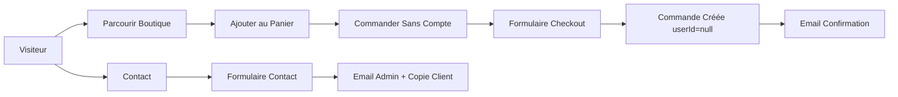
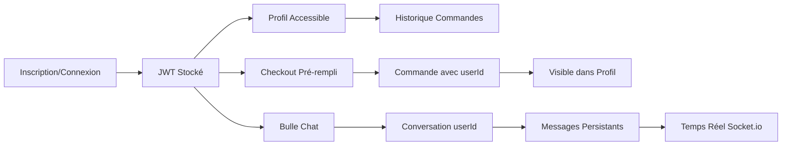
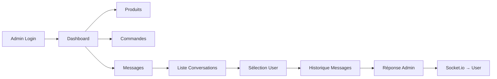

# 📋 Récapitulatif : Système d'Authentification Complet

## 🎯 Objectif Atteint

Transformation du site e-commerce **d'anonyme** vers un système complet avec :
- ✅ Authentification utilisateurs (JWT)
- ✅ Double parcours commande (invité vs connecté)
- ✅ Chat différencié (invité = contact email, connecté = chat temps réel)
- ✅ Profil utilisateur avec historique commandes
- ✅ Reset password avec emails
- ✅ Admin backoffice pour gérer les conversations utilisateurs

---

## 🔧 Backend : Ce qui a été ajouté

### 📦 Modèles Mongoose

#### `User.js` (modifié)
- **Ajouté** : `name`, `phone`, `addresses[]`, `resetPasswordToken`, `resetPasswordExpires`
- **Role** : `user` (par défaut) ou `admin`
- Méthodes : `comparePassword()`, `generateResetPasswordToken()`

#### `Conversation.js` (refactorisé)
- **Ancien** : `conversationId` (string localStorage)
- **Nouveau** : `userId` (référence User), unique par utilisateur
- Champs : `lastMessage`, `lastMessageAt`, `unreadCount`, `isResolved`

#### `Message.js` (refactorisé)
- **Ancien** : `conversationId` (string), `sender` (`client`/`admin`)
- **Nouveau** : `conversationId` (ObjectId), `userId`, `sender` (`user`/`admin`)
- Champs : `text`, `readByAdmin`, `createdAt`

#### `Order.js` (modifié)
- **Ajouté** : `userId` (optionnel, null pour invités)
- **Ajouté** : `customer.surname`, `address.governorate`, `address.line1`, `address.line2`

#### `Contact.js` (modifié)
- **Ajouté** : `surname`
- **Supprimé** : `subject`
- Envoi automatique d'emails (admin + client)

### 🛣️ Routes API

#### `/api/auth` (nouveau)
- `POST /register` - Inscription utilisateur
- `POST /login` - Connexion (user ou admin)
- `POST /logout` - Déconnexion
- `GET /me` - Obtenir utilisateur connecté
- `PUT /profile` - Mettre à jour profil
- `POST /forgot-password` - Demander reset password
- `POST /reset-password/:token` - Réinitialiser password
- `POST /create-admin` - Créer un admin (à sécuriser!)

#### `/api/conversations` (refactorisé - ex `/api/messages`)
- `POST /` - Créer/obtenir conversation (user)
- `GET /me` - Ma conversation avec messages (user)
- `GET /:id/messages` - Messages d'une conversation
- `POST /:id/messages` - Envoyer un message
- `GET /all` - Toutes les conversations (admin)
- `PUT /:id/read` - Marquer comme lu (admin)
- `PUT /:id/resolve` - Marquer comme résolu (admin)

#### `/api/orders` (modifié)
- `POST /` - Créer commande (avec `optionalAuth` middleware)
- `GET /me` - **NOUVEAU** : Mes commandes (user)
- `GET /` - Toutes les commandes (admin)
- `GET /:id` - Une commande
- `PUT /:id` - Mettre à jour statut (admin)

#### `/api/contact` (modifié)
- `POST /` - Envoie maintenant des emails (Nodemailer)

### 🔌 Socket.io (refactorisé)

**Avant :**
- Rooms par `conversationId` (localStorage string)
- Événements : `client-message`, `admin-message`, `join-conversation`, `join-admin`

**Après :**
- Authentification JWT : `socket.emit('authenticate', token)`
- Rooms : `user:{userId}` et `admin`
- Événements :
  - `new-user-message` (user → admin)
  - `new-message` (admin → user)
- Émission depuis les controllers via `req.app.get('io')`

### 📧 Nodemailer + Mailtrap

Emails automatiques :
- ✅ Bienvenue après inscription
- ✅ Reset password avec lien tokenisé
- ✅ Confirmation reset password
- ✅ Confirmation commande (client)
- ✅ Notification commande (admin)
- ✅ Contact reçu (admin + copie client)

### 🔐 Middleware

- `protect` : Vérifie JWT, ajoute `req.user`
- `admin` : Vérifie `req.user.role === 'admin'`
- `optionalAuth` : Associe `userId` si token présent (pour commandes)

---

## 🎨 Frontend : Ce qui a été ajouté

### 🧩 Context

#### `AuthContext.jsx` (nouveau)
- État : `user`, `isAuthenticated`, `loading`
- Méthodes :
  - `register(data)`
  - `login(email, password)`
  - `logout()`
  - `updateProfile(data)`
  - `forgotPassword(email)`
  - `resetPassword(token, password)`
  - `checkAuth()`

### 📄 Pages

#### Auth (nouvelles)
- `Login.jsx` - Connexion avec lien "mot de passe oublié"
- `Register.jsx` - Inscription (name, email, phone, password)
- `ForgotPassword.jsx` - Demande reset password
- `ResetPassword.jsx` - Formulaire nouveau mot de passe
- `Profile.jsx` - Profil + historique commandes

#### Modifiées
- `Checkout.jsx` - Pré-rempli si connecté (useEffect + useAuth)
- `Contact.jsx` - Uniquement visible pour invités

### 🧱 Composants

#### `Header.jsx` (modifié)
- **Si invité** : "Connexion" / "Inscription" + lien "Contact"
- **Si connecté** : Nom utilisateur + lien "Profil" (pas de "Contact")
- Responsive avec menu mobile

#### `Layout.jsx` (modifié)
- **Si invité** : Pas de chat
- **Si connecté** : `<UserChatWidget />`

#### `UserChatWidget.jsx` (nouveau)
- Bulle bleue flottante (bas droite)
- Connexion Socket.io avec authentification JWT
- Chargement conversation via `/api/conversations/me`
- Envoi messages via `/api/conversations/:id/messages`
- Mise à jour temps réel (`new-message` event)

#### `ProtectedRoute.jsx` (modifié)
- Gère `adminOnly` prop
- Redirige vers `/connexion` (users) ou `/admin/login` (admin)
- Affiche loader pendant `loading`

#### `AdminMessages.jsx` (refactorisé complet)
- Liste conversations (avec nom utilisateur, email, unreadCount)
- Sélection conversation → Affichage messages
- Envoi réponse admin
- Socket.io temps réel (`new-user-message` event)
- Marquer comme lu automatiquement

---

## 🚀 Déploiement

### Variables Environnement Railway

**Backend :**
```env
MONGODB_URI=...
JWT_SECRET=...
FRONTEND_URL=https://ecommerce-vetements-production.up.railway.app
MAILTRAP_HOST=sandbox.smtp.mailtrap.io
MAILTRAP_PORT=2525
MAILTRAP_USER=...
MAILTRAP_PASS=...
EMAIL_FROM="Boutique <noreply@example.com>"
ADMIN_EMAIL=admin@example.com
CLOUDINARY_CLOUD_NAME=...
CLOUDINARY_API_KEY=...
CLOUDINARY_API_SECRET=...
NODE_ENV=production
```

**Frontend :**
```env
VITE_API_URL=https://happy-hope-production.up.railway.app/api
VITE_SOCKET_URL=https://happy-hope-production.up.railway.app
```

---

## 📊 Flux Utilisateur

### 1. Invité (Sans Compte)



**Points clés :**
- ✅ Pas de bulle de chat
- ✅ Lien "Contact" visible
- ✅ Commandes sans `userId`
- ✅ Communication par email uniquement

### 2. Utilisateur Connecté



**Points clés :**
- ✅ Bulle de chat bleue visible
- ✅ Pas de lien "Contact" dans menu
- ✅ Formulaire checkout pré-rempli
- ✅ Commandes liées au compte
- ✅ Historique visible dans Profil
- ✅ Chat temps réel avec admin

### 3. Admin



**Points clés :**
- ✅ Voir toutes les conversations utilisateurs
- ✅ Noms, emails, messages
- ✅ Réponses en temps réel
- ✅ Badge unreadCount
- ✅ Marquer comme résolu

---

## 🔍 Différences Avant/Après

| Aspect | Avant | Après |
|--------|-------|-------|
| **Auth** | Admin uniquement | Users + Admin |
| **Chat** | Anonyme (localStorage) | Utilisateurs connectés uniquement |
| **Contact** | Pas d'emails | Emails automatiques (Nodemailer) |
| **Commandes** | Toutes anonymes | Liées au compte si connecté |
| **Historique** | Aucun | Profil avec historique commandes |
| **Reset Password** | N/A | Email avec lien tokenisé |
| **Socket.io** | Rooms par conversationId | Rooms par userId + auth JWT |
| **Messages** | conversationId string | conversationId ObjectId + userId |

---

## 📚 Documentation

- ✅ `GUIDE_DEMARRAGE_AUTH.md` - Tests locaux pas à pas
- ✅ `GUIDE_DEPLOIEMENT_AUTH.md` - Déploiement Railway complet
- ✅ `RECAP_SYSTEME_AUTH.md` - Ce fichier (récapitulatif)

---

## 🎯 Prochaines Étapes Recommandées

### 1. Production SMTP (Priorité Haute)
Remplacer Mailtrap par SendGrid/Mailgun pour emails réels.

### 2. Sécurité
- Rate limiting sur `/auth/login`, `/auth/register`, `/contact`
- CORS strict en production
- Rotation JWT_SECRET

### 3. UX
- Notifications push pour nouveaux messages chat
- Indicateur "admin en ligne"
- Upload avatar utilisateur

### 4. Fonctionnalités
- Sauvegarder plusieurs adresses de livraison
- Wishlist (favoris)
- Reviews produits
- Système de promotions/codes promo

### 5. Analytics
- Google Analytics
- Suivi conversions commandes
- Statistiques chat (temps réponse moyen, satisfaction)

### 6. SEO
- Meta tags dynamiques par produit
- Sitemap XML
- Schema.org markup
- Open Graph pour partage social

---

## ✅ Checklist Complétude

**Backend :**
- [x] User model avec bcrypt
- [x] JWT auth (register, login, logout, me, profile)
- [x] Reset password avec emails
- [x] Conversations liées au userId
- [x] Messages avec Socket.io auth
- [x] Order avec userId optionnel
- [x] Contact avec emails
- [x] Nodemailer + Mailtrap
- [x] Middleware protect/admin/optionalAuth

**Frontend :**
- [x] AuthContext complet
- [x] Pages Login/Register/ForgotPassword/ResetPassword/Profile
- [x] Header conditionnel (invité vs connecté)
- [x] UserChatWidget (bulle bleue)
- [x] Layout avec chat conditionnel
- [x] Checkout pré-rempli
- [x] Profile avec historique commandes
- [x] AdminMessages refactorisé
- [x] ProtectedRoute avec adminOnly

**Documentation :**
- [x] Guide démarrage local
- [x] Guide déploiement Railway
- [x] Récapitulatif système

**Tests :**
- [x] Inscription/Connexion
- [x] Chat utilisateur
- [x] Admin messages
- [x] Temps réel
- [x] Emails (Mailtrap)
- [x] Commande avec compte
- [x] Reset password
- [x] Contact invités

---

## 🏆 Résultat Final

✅ **Site e-commerce complet avec :**
- Double parcours (invité/connecté)
- Chat temps réel pour utilisateurs connectés
- Formulaire contact pour invités
- Historique commandes
- Reset password
- Admin backoffice
- Emails automatiques
- Déploiement Railway prêt

**Commits GitHub :**
- `e2fe83c` - Backend Auth + Refonte Messages/Conversations
- `ed29d7c` - Frontend complet (Header, Chat, Checkout, Profile)
- `079037c` - AdminMessages refactorisé
- `010465b` - Documentation complète

**Projet terminé et opérationnel ! 🎉**

